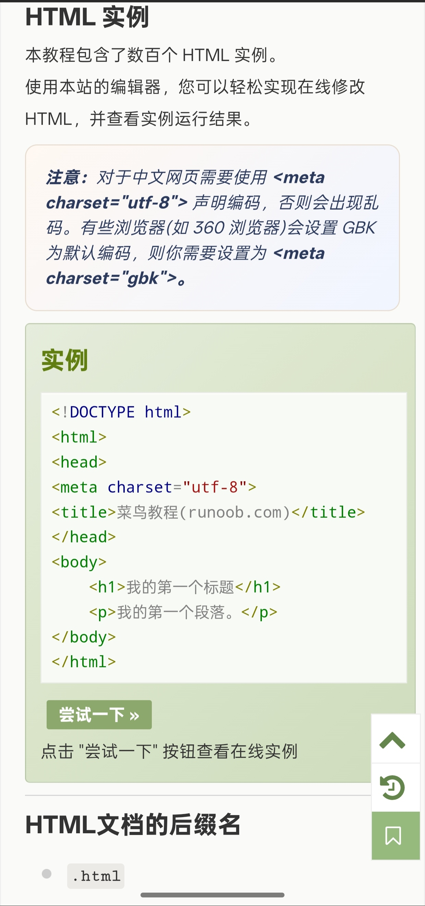
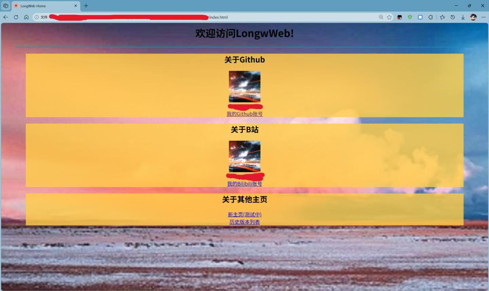
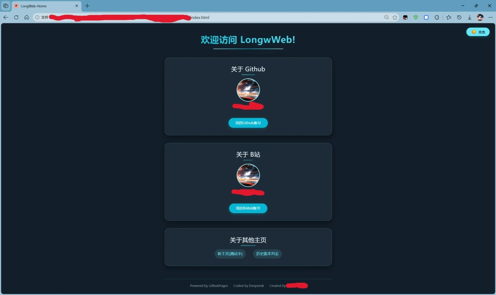
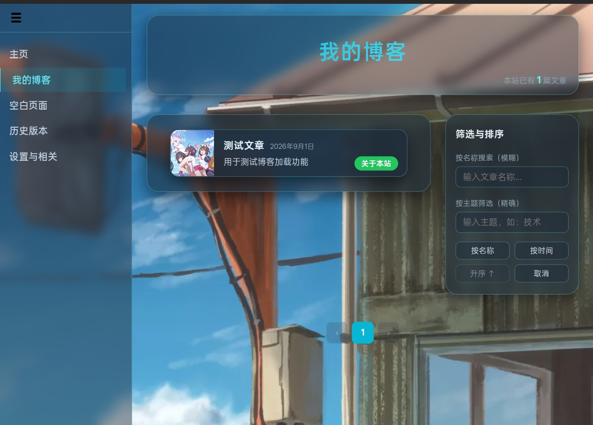

# 这是一篇关于这个网站的由来的文章

~~_其实都是一堆废话_~~
## 最开始的时候
在小时候，我读到了一篇关于博客的英语文章

在读到文章中的主人公能在这里分享一切时，我开始对博客产生了兴趣。但真正让我开始接触网站开发的，还是信息学竞赛

在信息学竞赛中，我积累了许多代码经验，这使我能够看懂并分析代码的结构

在看到知乎上一篇关于通过GitHubPages来创建个人博客的教程后，我开始了实践

根据教程进行但一直失败后，我便萌生了自己写HTML代码的想法

于是，我找到了菜鸟教程

### 经过数小时的学习与折腾，我终于在GitHub上发布了这样一个实验作

很简陋，对吧？

最开始，这个网页只有几个孤零零的链接，连历史版本列表都是后来加的

看着这样的“毛坯房”，我不忍心，于是开始寻找更为精美的“成品房”——即模板

## 模板的套用

在不断的寻找中，我找到了一个心仪的模板，并将其添加到了旧主页中，这也成为了现在的“新主页（测试中）”这一按钮

但由于模板的固定性，我最终还是决定停止维护这一页面

随着学业的压力，我不得不停止了对网页的开发与维护，这一网页也随之陷入了沉寂

## AI与Vibecoding

面对巨量的知识，学习总是一个漫长的过程过程

而AI着实缩短了这一过程

在了解到我的同学用codex写出了一个小游戏后，我便想起了这个尘封已久的网站。我开始着手使用DeepSeek翻新这个网页，下图便是最初的成果。

在这之后，我又不断尝试翻新它，有了不小的进展。

不久之后，dsh兴起了。恰逢此时我已苦于网页端ds的限制，便投身于dsh。

在使用dsh后，本站终于有了现代化的外观与博客的功能。

### END
